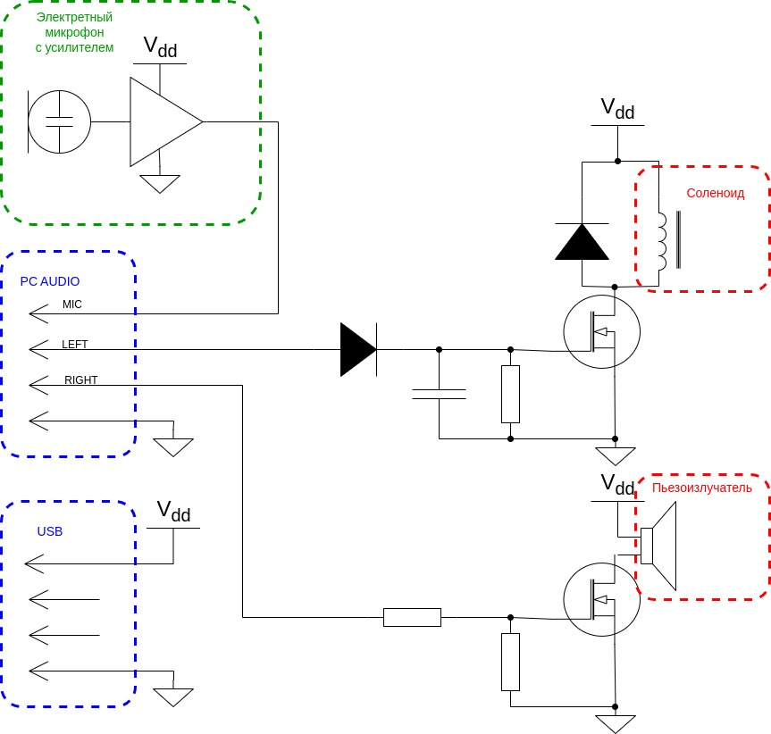
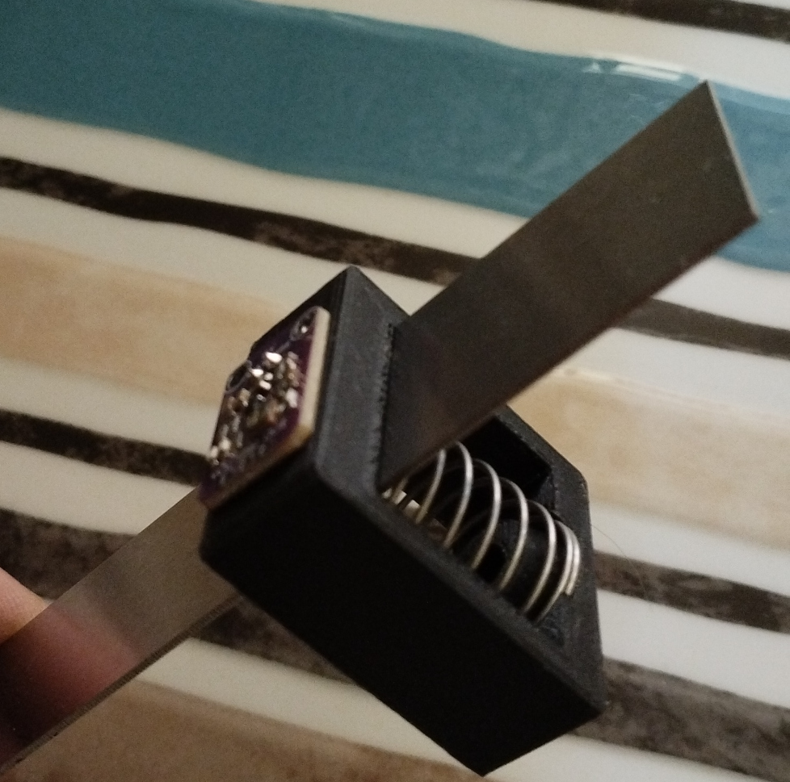

# vibration-absorbing

легко воспроизводимый стенд для оценки эффективности вибропоглощающих материалов

*у всех производителей "лучшая" шумоизоляция, что не удивительно. вот и хочется это проверить*

3D-модели для печати, простейшая схемотехника из готовых узлов с ali. никаких контроллеров, прошивок и тп - только аудиокарта компьютера

это **не** инструмент для **измерения**, предполагающий соответствие стандартам, поверку и тп.
речь идет о простейшем стенде для **сравнения** материалов, основывающимся на физике процесса  

## физика процесса

- на стандартную качественную металлическую линейку приклеиваем фиксированный кусок вибропоглощающего материала
- подвешиваем
- возбуждаем с одного конца
- записываем аудио с другого
- строим [спектрограмму](https://ru.wikipedia.org/wiki/%D0%A1%D0%BF%D0%B5%D0%BA%D1%82%D1%80%D0%BE%D0%B3%D1%80%D0%B0%D0%BC%D0%BC%D0%B0) и сравниваем

поскольку линейка, возбудающее воздействие и размеры материала одинаковые, разница в спектрограмме определяет эффект, а именно:
- передача начального возбуждения
- затухание во времени (с учетом спектрального состава)

## мысли и материалы

- подключаемся к компу через аудио разъем. запитываемся через USB
- в качестве датчика изпользуем [электретный микрофон с усилителем](https://aliexpress.ru/item/32729363317.html?spm=a2g2w.orderdetail.0.0.7df34aa6HsUqV3&sku_id=61285789691)
- крепеж микрофона [3d модель](3d/mic-mount.scad) [stl](3d/mic-mount.stl) [фото](mic-mount.jpg). Пружина тоже с алика.
- [пластина для тестов](https://www.vseinstrumenti.ru/product/blestyaschaya-metallicheskaya-linejka-300mm-enkor-10851-1269276/) 
- для возбуждения хочу попробовать
-- [соленоид с закрытой рамой](https://aliexpress.ru/item/1005004820509005.html?spm=a2g2w.orderdetail.0.0.16c64aa6WpV2FG&sku_id=12000030612744837), ударяющий по линейке
-- [соленоид с открытой рамой](https://aliexpress.ru/item/1005003598549089.html?spm=a2g2w.orderdetail.0.0.49a14aa6APhDcR&sku_id=12000030405384012), касающийся линейки корпусом
-- пьезоизлучатель
- [типа "макетная плата для сборки"](https://aliexpress.ru/item/1005006687101923.html?sku_id=12000038016344681&spm=a2g2w.productlist.search_results.5.353c1d74pm2CIm), на которую можно налепить 
-- n-канальный MOSFET *AO3414*
-- мелочевку вроде 1206 и 0805 резисторов и конденсаторов
-- диоды *1N4148*
- [4х контакнтый аудио разъем](https://www.vseinstrumenti.ru/product/razem-audio-video-pro-legend-3-5mm-shteker-4-kontakta-metall-na-kabel-pl2108-6253483/)

[Схема.](sch.drawio) Накидал в drawio, сори: у меня никакие САПР-ы сейчас не установлены
 

Логика следующая: пробуем 2 варианта возбуждения пластины 
- один канал просто раскачивает пьезоизлучатель
- второй канал выделяет огибающую и дергает соленоид

что будет лучше работать, то и оставим

 - напечатанный крепеж микрофона
## софт

тут все просто: нарисую и выложу сразу на golang (чтобы собрать запускаемые бинари для разных платформ) и python (для сомневающихся)

буду благодарен за компиляцию под винду: у меня только linux, у ребенка скомплилирую под мак (darwin)

**Всячески приглашаю к участию!**
